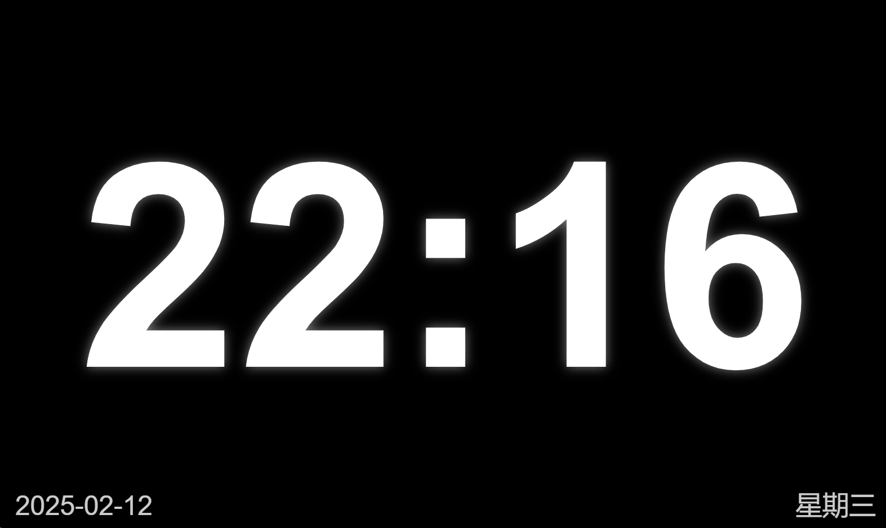

# Home Assistant Time Screensaver

这是一个Home Assistant的HACS前端插件，用于在Home Assistant界面上添加屏保功能。

## 安装
### 方法1
1. 首先确保已安装HACS
2. 在HACS中添加自定义仓库https://github.com/qq273681448/ha-time-screensaver
3. 搜索"Time Screensaver"并安装
4. 刷新页面
### 方法2【暂不支持】
1. 搜索"Time Screensaver"并安装
2. 刷新页面

## URL上参数配置
### screenTime 参数
自动进入屏保时间（秒，默认60秒）

screenTime=-1 时，屏保程序完全不会启动

例如：

?screenTime=-1 - 不启动屏保

?screenTime=5 - 5秒后启动屏保

### allPage 参数

当 allPage=0 时：

只在 /lovelace 路径下显示屏保，其他路径下会禁用屏保

当 allPage 不为 0 或不存在时：

屏保会在所有路径下正常工作

例如：
?allPage=0 - 只在 /lovelace 路径下显示屏保
?allPage=1 - 在所有路径下显示屏保